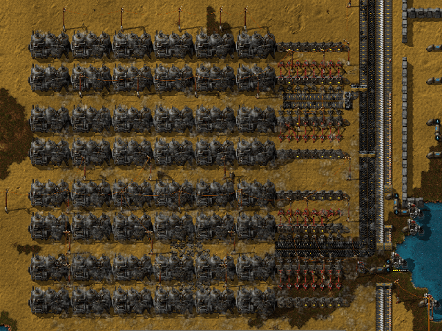
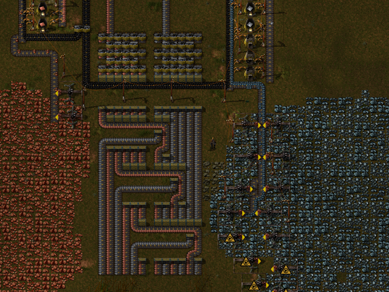
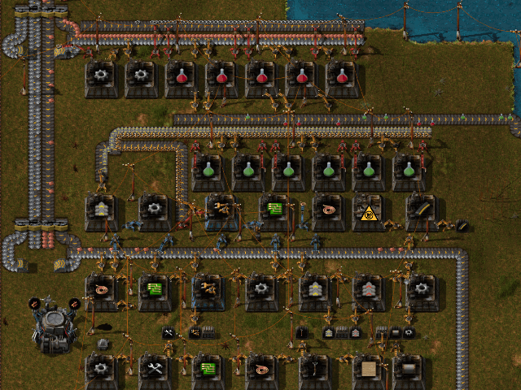
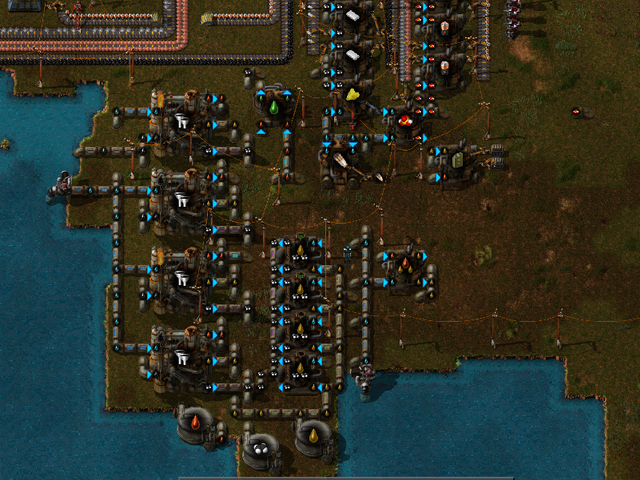
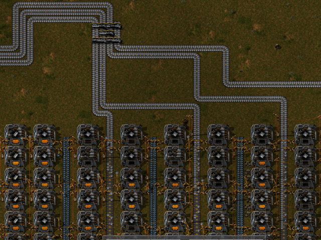
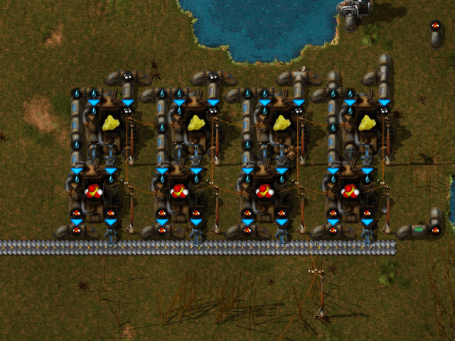
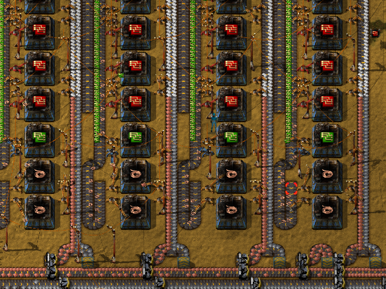
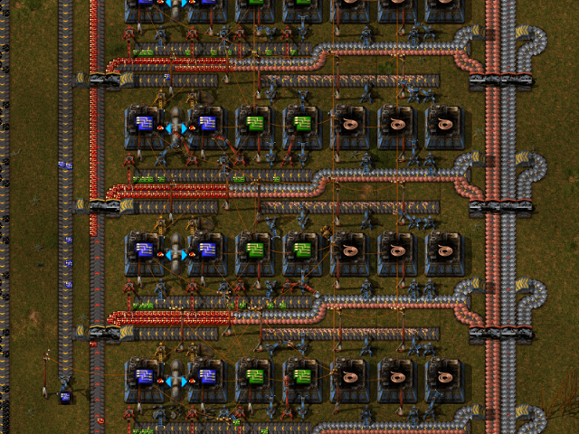
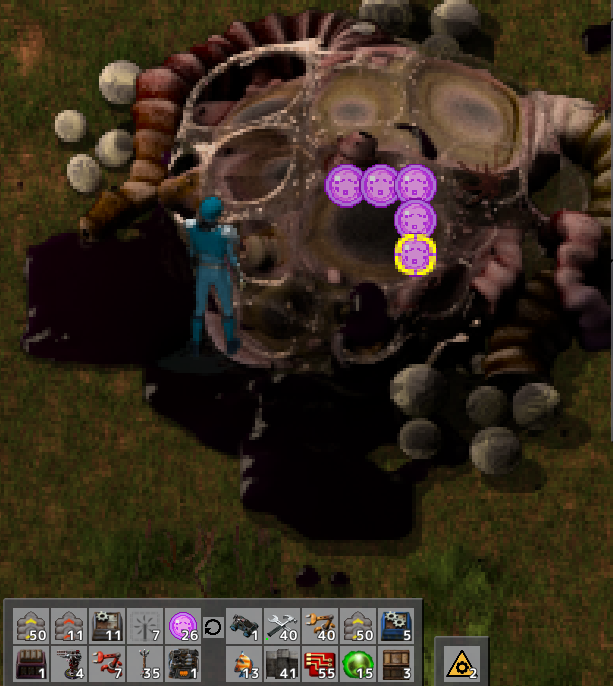

# 資源ざくざくで囲い込みが容易な立地のMapコード
    >>>AAAMAAMAAAADAwYAAAAEAAAAY29hbAMFBAoAAABjb3BwZXItb3Jl
    AwUECQAAAGNydWRlLW9pbAMFBAoAAABlbmVteS1iYXNlBQUECAAAAGl
    yb24tb3JlAwUEBQAAAHN0b25lAwQEOdHDHvxXAADfmwAAAAAAAAAAAA
    AFAEBJg2Y=<<<

# ツール
[必要施設数計算機](../FactorioCalculator.html)
生産物を秒間いくつ作りたいか入力すると、それに必要な施設数を表示してくれる。
最新データに追従できているかは怪しい。
というかこれを使うくらいなら、公式Forum内で公開されている[こっち](http://www.factorioforums.com/forum/viewtopic.php?f=8&t=5576) のツールを使ったほうが良いと思うよ。

# プレイ方針
自分の場合、ライン設計はシンプルさを重視する。
具体的には、原則銅と鉄のみをベルトコンベアで流し、必要となるインサータや電子回路等の中間部品はその場で生産する。

# 設計コレクション
## 石炭発電所
拡張性を重視して広い場所に建てよう。バージョン0.12になってレーザータレットの消費電力量が増えた結果、中盤以降でも活躍の機会が増えたため、石炭輸送のベルトコンベアは4列にしておいたほうが、拡張性的な意味で良いかもしれない。

## 鉄板銅板搬出路
入力側は4列で十分足りる。中盤以降は上部を高速分配器に置き換えるのが吉。

## サイエンスパック1 & サイエンスパック2 & スマートインサータ
後述するが、このSSの位置で鋼材を作るとベルトコンベア1では鉄が足りなくなってしまうので、そこは真似しないこと。  

## 原油コンビナート
本当はもっと広い場所に建て、重油/軽油分解は離れた場所で行ったほうが何かと楽。
また、液体は地下を移動させるのが楽なので、電池やプラスチックは銅と鉄にアクセスしやすい離れた場所で作ったほうが良い。

## 精錬施設
鉄の生産量が低下しても全ラインに均等に供給され、詰まったラインがあっても余剰分は別のラインに供給される仕組み。端はベルトコンベアを片側しか使えないので鋼材にしてしまっている。  

## 硫酸生産

## 発展回路量産
発展回路組立機は縦方向に8つ。このSSは1箇所ミスがあり、実際には銅線組立機は1列につき3つ必要なので注意。サイエンスパック3を作るだけなら1列でこと足りるので、2列目以降は建設ロボが解禁されてからでも良い。  

## 制御回路量産

# やること一覧
* 精錬設備
* 石炭発電所
* 初期技術開発
* SP1,2&スマートインサータ生産ライン
* 日用品(ツール)ライン
    * 電柱,ベルトコンベア1&2,インサータ,リペアキット,弾薬をそれぞれ200個くらいずつ生産。
* 日用品(素材)ライン
    * 電子回路,鋼材を一定数生産
* 原油コンビナート
* 電池&プラスチック生産ライン
* 発展回路量産ライン
* SP3生産ライン
* 応用原油処理への切り替え
* 電気精錬設備
* ロボットネットワークの構築
* ソーラーパネル&蓄電池用の土地の確保と施設
* 制御回路量産
* ロケットサイロの下準備

# ライン構成
* 1st line
    * 役割: SP1と2の供給およびSP3用のスマートインサータの生産
    * 搬入資源
        * 鉄(ベルトコンベア1/秒間10個)
        * 銅(ベルトコンベア1/秒間10個)
    * 生産物
        * SP1
            * 秒間生産: 0.5個(組立機数:3)
            * 秒間消費: 鉄1, 銅0.5
        * SP2
            * 秒間生産: 0.5個(組立機数:3)
            * 秒間消費: 鉄2.75, 銅0.75
        * スマートインサータ(SP3用)
            * 秒間生産: 0.5個(組立機数:1)
            * 秒間消費: 鉄6, 銅5.25
    * 備考
        * 好みによるが、近くに研究施設8つとSP3組立機を作ることが多いと思うので、それも計算に入れた場所に作ろう。
* 2nd line
    * 役割: 電子回路と鋼材の量産
    * 搬入資源
        * 鉄(ベルトコンベア1/秒間10個)
        * 銅(ベルトコンベア1/秒間10個)
    * 生産物
        * 電子回路
            * 秒間生産: 4個(組立機数:2)
            * 秒間消費: 鉄4, 銅6
        * 鋼材
            * 秒間生産: 1個(組立機数:9)
            * 秒間消費: 鉄5
    * 備考
        * 後々ベルトコンベアを高速なものに置き換える前提でスペースに余裕を持たせておくと良いかも
        * ソーラーパネルはここで作ると楽。中盤で1000個、クリア直前に2000個あれば十分だろう。

* 3rd line
    * 役割: 日用品(ツール)の生産
    * 搬入資源
        * 鉄(ベルトコンベア1/秒間10個)
        * 銅(ベルトコンベア1/秒間10個)
    * 生産物
        * 電柱
        * ベルトコンベア1
        * ベルトコンベア2
        * インサータ
        * リペアキット
        * 弾薬
    * 備考
        * ラインの末尾に銅鉄格納用チェストを配置しておくと便利。

* 4th line
    * 役割: 原油系資源を使う物資の量産
    * 搬入資源
        * 鉄(ベルトコンベア1/秒間10個)
        * 銅(ベルトコンベア1/秒間10個)
        * 石炭(ベルトコンベア1/秒間10個
        * プロパンガス
        * 潤滑油
    * 生産物
        * 電池
            * 秒間生産: 1個(組立機数:5)
            * 秒間消費: 鉄1, 銅1, プロパンガス
        * プラスチック
            * 秒間生産: 8個(組立機数:4)
            * 秒間消費: 石炭4, プロパンガス
        * 飛行ロボットフレーム
            * 秒間生産: 0.05個(組立機数:1)
            * 秒間消費: 鉄0.4, 銅0.225
    * 備考
        * SP3を秒間0.5個作るために、電池は秒間0.5個必要になる。そのため蓄電池やレーザータレットのために常時利用できる電池は秒間0.5個分。SP3を必要としない研究も多いので、その間の生産分は利用できるはいえ、少し多めに作っておいたほうが楽。
        * 飛行ロボットフレームは組立機数を倍にしても良いかもしれない。
        * 必要な数の飛行ロボットフレームがそろったら、生産は打ち止めにして、終盤のアーマー製作に必要となる電気エンジンユニットをチェストに貯めておくようにすると、後々楽。
        * 銅と鉄はまとめて1つのベルトコンベアで輸送しても良いかも。
* 5th line
    * 役割: 発展回路の量産
    * 搬入資源
        * 鉄(ベルトコンベア2/秒間20個)
        * 銅(ベルトコンベア2/秒間20個)
        * プラスチック(ベルトコンベア1/秒間10個)
    * 生産物
        * 発展回路
            * 秒間生産: 4個(組立機数:32)
            * 秒間消費: 鉄8, 銅20, プラスチック8

* 6th line
    * 役割: 制御回路の量産
    * 搬入資源
        * 鉄(ベルトコンベア2/秒間20個)
        * 銅(ベルトコンベア2/秒間20個)
        * 発展回路
        * 硫酸
    * 生産物
        * 発展回路
    * 備考
        * 大量消費する電子回路を搬入してくるのは現実的でないのでここで銅鉄から生産しよう。

* その他メモ
    * プラスチック組立機は5or6個用意するのが適当？
    * 飛行ロボットフレームは2ライン用意したほうが中盤のゲーム展開的に良いかもしれない。

# 各種試算
60分で全素材を集める場合に必要な施設数。簡単に用意できる素材については割愛。

## ソーラーパネル&蓄電池&レーザータレット
* ソーラーパネル
    * ソーラーパネル(1000)
        * 秒間0.4個(組立機数:4)
    * 鋼材(5000)
        * 秒間1.5個(組立機数:15)
    * 電子回路(15000)
        * 秒間4.5個(組立機数:3)
    * 銅板(5000)
        * 秒間1.5個(電気炉:3)

* 蓄電池
    * 蓄電池(1000)
        * 秒間0.4個(組立機数:4)
    * 鉄板(2000)
        * 秒間1個(電気炉:1)
    * 電池(5000)
        * 秒間1.5個(組立機数:8)

* レーザータレット
    * レーザータレット(500)
    * 鋼材(10000)
        * 秒間3個(組立機数:30)
    * 電子回路(10000)
        * 秒間3個(組立機数:2)
    * 電池(6000)
        * 秒間2個(組立機数:12)

## ロケットサイロ
発展回路については前述の設計のとおり、組立機32個で足りる。
大量の鋼材の生産を怠らなければそれなりの時間で準備できるだろう。

* 断熱材(1000)
    * 鋼材(10000)
        * 秒間3個(組立機数:27)
    * 銅板(5000)
        * 秒間1.5個
    * プラスチック(5000)
        * 秒間1.5個(組立機数:1)
* ロケット燃料(1000)
    * 固形燃料(10000)
        * 秒間3個(組立機数:3)
* ロケット制御ユニット(1000)
    * 制御基盤(1000)
        * 秒間0.3個(組立機数:3)(発展回路組立機数:5)
    * 生産速度モジュール(1000)
        * 秒間0.3個(組立機数:5)(発展回路組立機数:12)
* ロケットサイロ(1)
    * 鋼材(1000)
        * 秒間0.3個(組立機数:3)
    * コンクリート(1000)
        * 秒間0.3個(組立機数:1)
    * 制御基盤(200)
        * 秒間0.06個(組立機数:1)
    * 電気エンジンユニット(200)
        * 秒間0.06個
* 衛星(1)
    * 断熱材(100)
    * 制御基盤(100)
    * ロケット燃料(50)

# Tips
サイエンスパックの生産は秒間0.5個(組立機換算で各3つ)で十分。SP1と2はその気になれば秒間2個くらいは余裕で作れるが、研究だけ急いでもすぐにそれ以外がボトルネックになってくる。そして何よりサイエンスパック3をそれにあわせて量産するのがキツい。

精錬は、電気掘削機20で採掘した鉱石をベルトコンベア1の両側に乗せて運搬し、電気炉18で精錬するのが良い。
ベルトコンベア2を使えばもっと流量は増やせるが、スペース的に辛いだろう。

# チートとか
微妙すぎる性能のランプは、 data\base\prototypes\entity\demo-entities.lua の name = "small-lamp" 付近の light = {intensity = 0.9, size = 40} の値を変更してやることで強化することができる。200くらいにして遊ぶのが個人的にはオススメ。

# おまけ
data\base\graphics\icons\alien-artifact.png 差し替え画像。  

使用例  

